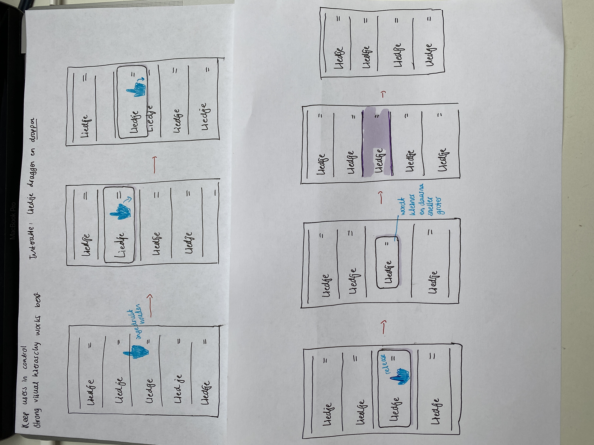

# Frontend voor Designers - opdracht 1: Een Micro-interactie uitwerken en testen

Ontwerp een user interface voor een gegeven use case. Werk je ontwerp uit in HTML, CSS en Javascript om te kunnen testen in een browser.

Lees hier de [opdrachtbeschrijving](./opdrachtbeschrijving.md).

# Volgorde veranderen
Beschrijf hier je eigen project.

Ik ga een micro interactie maken waarbij je een list item (een liedje) kunt verplaatsen zodat de volgorde van de lijst wordt aangepast. Het list item plaatst zich boven de rest van de list-items wanneer je hem dragt, en als je hem weer loslaat valt hij als het ware terug in de lijst.

Hieronder een foto van mijn eerste schets hiervan:

DEMO 1:
(https://emmabons.github.io/frontend-voor-designers-2021/opdracht1/demo/index.html)

DEMO 2:
(https://emmabons.github.io/frontend-voor-designers-2021/opdracht1/demo-v2/index.html)

## interface
Leg de interface uit. In de demo heb je de interface design principles 04 & 11 van [Principles of User Interface Design](http://bokardo.com/principles-of-user-interface-design/) toegepast. Hoe heb je dat gedaan?

Keep users in control:
Ik geef de controle aan de gebruiker door goed te laten zien wat er gebeurt. Wanneer een gebruiker over een item hovert verandert de kleur en de cursor, zodat de gebruiker ziet dat hij er iets mee kan doen.

Verder had ik nog uit willen werken dat de gebruiker bij het draggen het item meer op zou pakken voor meer duidelijkheid, maar dit is me niet gelukt.

Visual hierarchy works best:
Beetje hetzelfde als hierboven, met het hoveren. Daarnaast heeft de lijst met items een opvallende neutrale kleur en heb ik dmv verschillende lettergroottes en diktes aangegeven welke teksten belangrijker zijn.

## code
De js zorgt voor een kleine animatie, die mbv een open source code bestand is opgezet.
